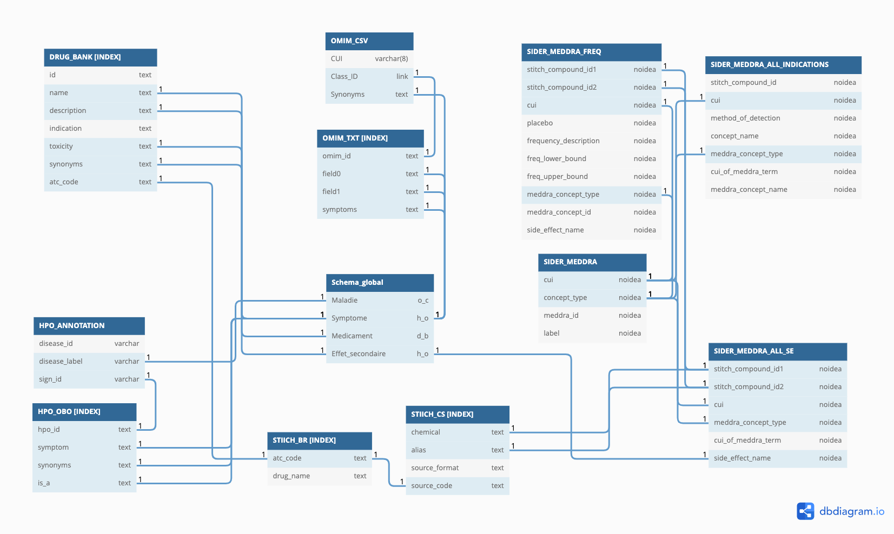

# gmd2k22

## Teacher
-ARIDHI Sabeur

## Team members
- ABDOULHOUSSEN Hamza
- ALLOUCHE Kamal
- BOULECHFAR Sami

## Work subject
[Work subject](Sujet.pdf)

## Usefull links
- documentation  
[pandas documentation](https://pandas.pydata.org/docs/)  
[Introduction to Apache Lucene](https://www.baeldung.com/lucene)  
[pytest documentation](https://docs.pytest.org/en/7.1.x/)  
[subprocess documentation](https://docs.python.org/3/library/subprocess.html)  

- data  
[omim website](https://www.omim.org/)  
[drugbank](https://go.drugbank.com/releases/latest)  

## Link to the diagram
[Diagram](https://dbdiagram.io/d/62470edfd043196e39dbc1bd)

## Presentation
[Presentation](Presentation_projet_GMD.pdf)

